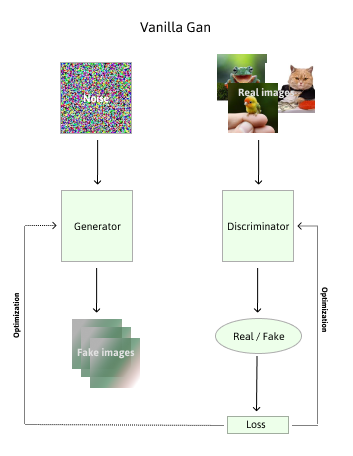

# Vanilla GAN

## What is a GAN ?
A GAN is a type of generative model that learns to generate data that is similar to some real-world dataset it was trained on. The key idea behind GANs is to have two neural networks, the generator and the discriminator, compete against each other in a two-player minimax game.

- Generator: This network takes random noise as input and generates synthetic data samples. The goal of the generator is to create data that is indistinguishable from real data.

- Discriminator: This network is a binary classifier that tries to distinguish between real data from the training set and synthetic data produced by the generator. The discriminator's objective is to correctly classify whether a given sample is real or generated.
  
During training, the generator's objective is to fool the discriminator, while the discriminator's objective is to correctly identify whether a sample is real or generated. This adversarial process leads to the generator producing increasingly realistic data over time.

## Types of GAN

There are several variants and extensions of the original GAN architecture, each designed for specific applications or to address certain limitations. Some of the most notable types of GANs include:

- Conditional GANs (cGANs): These models take additional conditioning information as input, allowing for controlled generation. For example, given a class label, a cGAN can generate images specific to that class.

- Deep Convolutional GANs (DCGANs): DCGANs use convolutional neural networks (CNNs) in the generator and discriminator, which are particularly effective for generating images. They introduce architectural guidelines that enhance the stability and quality of generated images.

- CycleGANs: CycleGANs are used for image-to-image translation tasks, where they learn to map images from one domain to another without paired training data. This is useful for tasks like style transfer or domain adaptation.

- StyleGAN and StyleGAN2: These models are known for generating highly realistic images, particularly faces. They introduce techniques like style-based architecture and progressive growing to improve image quality.

